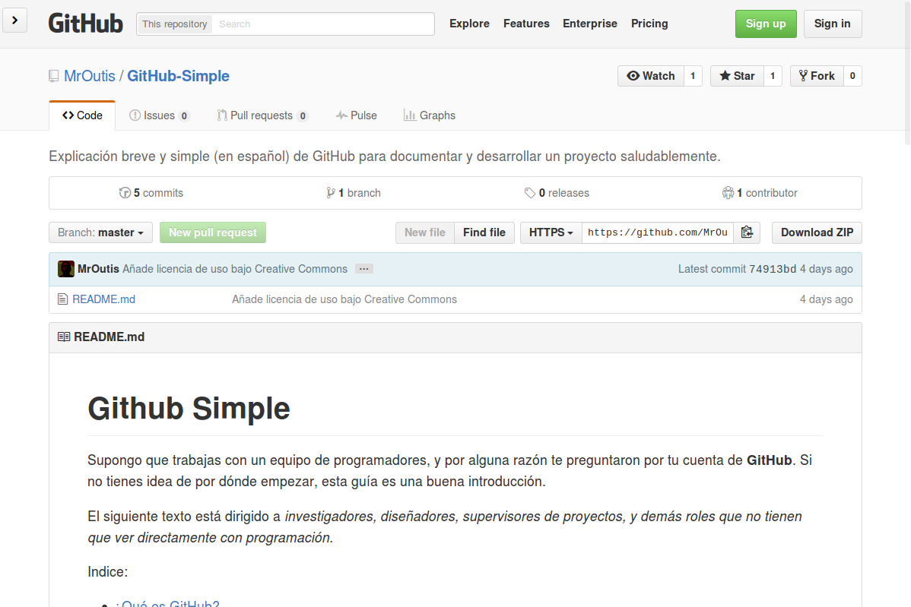

# GitHub Simple

Supongo que trabajas con un equipo de programadores, y por alguna razón te
preguntaron por tu cuenta de **GitHub**. Si no tienes idea de por
dónde empezar, esta guía es una buena introducción.

El siguiente texto está dirigido a *investigadores, diseñadores, supervisores
de proyectos, y demás roles que no tienen que ver directamente con programación.*

Indice:
  - [¿Qué es GitHub?](#qu%C3%A9-es-github)
    + [¿Qué es Git?](#qu%C3%A9-es-git)
    + [¿Y el Hub?](#y-el-hub)
    + [¿Entonces...?](#entonces)
    + [¿Cómo hago una cuenta?](#c%C3%B3mo-hago-una-cuenta)
  - [Repositorios](#repositorios)
    + [Encabezado](#encabezado)
      * [Panel de Código](#panel-de-c%C3%B3digo)
    + [README](#readme)
      * [Desarrollo Guiado por README](#desarrollo-guiado-por-readme)
  - [Fuentes documentales](#fuentes-documentales)

--------------------------------------------------------------------------------

# ¿Qué es GitHub?
Se puede entender como una palabra compuesta: **Git** y **Hub**.

## ¿Qué es Git?
Una herramienta que facilita la colaboración:
> Imagínate que tú y Beto deciden dibujar juntos en la escuela, pero quieren
> terminar el dibujo cada quien en su casa. La maestra saca 2 fotocopias de lo
> que hicieron en clase y se la llevan a casa (**clone | pull**).
>
> Tanto como tú y Beto le añaden cosas al dibujo (**add**), y a cada cosa que
> añaden le ponen una nota explicando lo que agregaron (**commit**).
>
> Cuando regresan a la escuela, la maestra corta y pega los dibujos en uno solo
> (**merge**), si ambos colorearon la misma área (**merge conflict**) alguien
> decide qué versión se usa, si la de Beto o la tuya.
>
> Y como son fotocopias, pueden hacer los cambios que quieran sin dañar
> el original.
>
> Si deciden ver *quién hizo qué cambio y por qué*, sólo basta con
> ver las notas que anexaron tú y Beto (**log**). Y hasta pueden comparar las 2
> versiones (**diff**).
>
> Si alguien más quiere dibujar con ustedes, sólo necesita una copia del
> original (**clone**).

Ese sería un flujo de trabajo con **Git**. Las palabras que están en
**negritas** es el nombre en inglés que se le da a esa acción.

*Si son de los que olvidan los comandos de Git, aquí los pueden checar:*
[Hoja de comandos de Git en español](https://github.com/ArslanBilal/Git-Cheat-Sheet/blob/master/other-sheets/git-cheat-sheet-es.md)

*Y si quieres meterle esteroides a tu Git, checa este enlace:*
[Git Extras](https://github.com/tj/git-extras)

*Por favor, traten de usar la guía de estilo:*
[Guía de estilo de Git](https://github.com/agis-/git-style-guide)

## ¿Y el *Hub*?
Un espacio *en linea* para tener un respaldo de tus proyectos.

## ¿Entonces...?
**GitHub** es *un espacio en linea para tener un respaldo de tus proyectos* que
usen *Git*, enfocado a **proyectos de programación con código abierto**.

Cuando digo *código abierto* me refiero a que la gente pueda ver cómo está
construido el proyecto (ver el código fuente).

Los proyectos están organizados en **repositorios**. Es un lugar donde se
almacenan los archivos que conforman el proyecto.

Crear una cuenta en **GitHub** es gratuito, siempre y cuando tus proyectos sean
abiertos al público. Si quieres restringir el acceso a tus proyectos puedes
pagar por ello una subscripción mensual.

## ¿Cómo hago una cuenta?
Ingresa a la página principal de [Github](https://github.com) y en los campos
de texto llena tu `nombre de usuario`, `correo electrónico`, y `contraseña`.

## ¿Y ahora qué hago?
Si ya tienes un proyecto en el que estés trabajando, ve al repositorio.
El enlace se debe de ver algo así:
`http://github.com/usuario/nombre-del-repositorio`

--------------------------------------------------------------------------------

# Repositorios
Es el lugar donde están todos los archivos del proyecto, incluyendo la
documentación. Los repositorios pueden tener multiples colaboradores y pueden
ser **publicos** o **privados**.

Un repositorio se ve así:

Repasaremos la interfaz del repositorio, empezando de arriba hacia abajo.

## Encabezado

Contiene el **propietario** y el **nombre** del repositorio.

También hay tres botones que representan acciones:

  - : Recibes notificaciones cuando hay algún
  cambio en el proyecto. Sirve para estar al dia.

  - : Se utilizan para tener **fácil acceso** a
  un proyecto, y para mostrarle tu amor al repositorio, similar a los **likes**
  en Facebook :+1:.
  *Si quieres ordenar tus Stars puedes utilizar [AstralApp](http://astralapp.com/)*

  - : Haces una **copia** del repositorio en tu
  cuenta de GitHub. Así puedes hacer cambios sin afectar el original.
  También te permite **sugerir cambios** y **traer actualizaciones** del original a tu *fork*.
  Se utilizan para **iterar** sobre **ideas** e **implementaciones**
  manteniendo el original intacto.

Y una barra de navegación:

Vamos a explorar cada una de las pestañas, empezando por **Code**.

### Panel de Código

Contiene una descripción corta del proyecto.
Algunas métricas y acciones de **Git**.
Y un listado de archivos que contiene el repositorio.

## README
Es el documento que da la **bienvenida** a tu projecto.

Se traduce del inglés como **LEEME**.

Sirve como **introducción**, y es un buen lugar para **explicar** o **vender**
tu idea. Si quieres que la gente **utilice** y/o **contribuya** a tu proyecto,
aquí debes de convencerlos.

Normalmente las personas ven el README en un navegador, y para que no se vea
como un simple texto, se le agrega formato utilizando
[Markdown](https://es.wikipedia.org/wiki/Markdown) (de ahí viene la extención de archivo `.md`).

### Desarrollo guiado por README
El README es la [piedra angular](https://es.wikipedia.org/wiki/Piedra_angular) de un proyecto.

Si empiezas por escribir un documento sencillo que sirva como introducción,
quien colabore podrá tener siempre presente el **¿Por qué?** y **¿Para qué?**
del proyecto, mejorando la **comunicación** y respaldando que todos estén
apuntando a la misma dirección.

Te ayudará a conocer **qué implementar** para cumplir los ideales
del proyecto.

Además, es un esquema bastante sencillo para **aterrizar las ideas**.
Facilita que se pueda **discutir** e **iterar** sin perder el rumbo.

--------------------------------------------------------------------------------

# Fuentes documentales
  - [Explicación sencilla de Git](https://www.reddit.com/r/explainlikeimfive/comments/jgoxv/eli5_how_do_you_use_git_and_github/)
  - [Awesome GitHub](https://github.com/phillipadsmith/awesome-github)
  - [Awesome README](https://github.com/matiassingers/awesome-readme)
